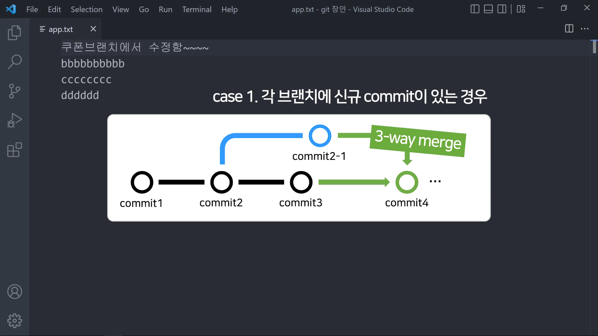

# Table of Contents
* [Git 소개](#Git_Introduction)
* [필수 명령어](#Essential_Command)
* [Merge 방식 소개](#Introducing_Merge_Method)
* [고급 명령어](#Advenced_Command)

# Git_Introduction
## Git 이란
	git은 파일 버전 기록해주는 프로그램, 원할 때마다 과거로 돌아갈 수 있다.
    repository는 git이 파일을 기록해두는 장소.
    파일을 git으로 등록하면 그 파일안에 숨긴 폴더로 .git 폴더가 하나 생성되는데 그게 repository다.
## 깃허브
	git만 이용해서는 원격으로 여러명이서 작업할 수가 없음.
	그래서 깃허브 사이트를 이용하여 여러명이서 파일을 공유함.
    git push 원격저장소주소 업로드할로컬브랜치명
# Essential_Command
## 로그인
    git 설치후
    폴더 파일 열어서
    git config --global user.email "이메일"
    git config --global user.name "이름"
    이것을 해줘야 git 사용 가능.
    이름에 한글명 작성 가능.
## git init
	원하는 폴더를 명령 프롬프트로 열어서 git init을 입력한다.
	그럼 그 폴더는 git에 등록된다.
	하지만, 이 방법은 깃허브를 사용하지 않고 혼자서 작업할 경우 추천함.
## git clone
	먼저 깃허브에서 repository를 생성한 뒤, 이것을 컴퓨터에 다운받아서 작업을 시작한다.
	나는 무조건 이렇게 시작함.
	다른 사람들의 repository를 다운받는 경우에 사용함.
## git add .
	반드시 .(마침표)을 사용해야 됨.
	마침표는 모든 파일을 선택한다는 뜻임.
	모든 파일을 선택해서 저장할 준비(스테이징)을 한다는 뜻임.
	원하는 파일만 선택해서 저장을 하는 경우도 있지만 대부분 git add .을 사용함.
## git commit -m '남기고 싶은 메시지'
	저장할 준비를 마친 파일들을 저장하는 명령어.
	어떤 작업을 했는지 항상 메시지를 남겨야 저장이 가능하다.
	''(따옴표)가 들어가야한다.
## git push
	저장한 파일을 깃허브에 업로드하는 명령어
	git push 깃허브주소 브랜치이름	
`ex) git push https://github.com/eunsu0409/eunsu.git main`
## git push -u
    git push 할 때, -u 추가하면 주소를 매번 입력안해도 되는 기능.
    한번 git push -u https://github.com/eunsu0409/eunsu.git main을 했으면,
    다음부터는 그냥 git push만 입력해도 가능.
    하지만, 여러가지 git repository를 사용하는 경우가 많으니 추천하지 않음.
## git pull
	원격 저장소에서 로컬로 다운받고 현재 branch에 합치는 명령어.
    파일 최신화가 안되있으면 push가 불가능함. 그래서 최신화 해줘야됨.
    git pull 원격저장소주소 브랜치명
    마찬가지로 git push할 때 -u를 잘 채워놨으면 pull 뒤에 안써도 됨.
## git fetch
    git fetch : 원격저장소 신규 commit 가져오기.
	하자만, 보통 각자 1인 1 branch로 작업을 하기 때문에 git fetch보다는 git pull을 사용하는 편임.
## git log --oneline
	어떤 작업을 했는지 확인하는 명령어.
	vscode로 extension 설치하거 github desktop 프로그램을 설치하여 작업 내역 확인 가능.
## git branch 브랜치이름
	파일을 복사하여 작업하는 명령어.
	예시) git branch ui
	이런식으로 작업 내역에 알맞는 branch를 생성.
	브랜치이름을 입력하지 않고 명령어를 작성하면 현재 생성되어 있는 모든 branch이름을 볼 수 있다.
## git switch 브랜치이름
	생성한 branch로 이동하는 명령어.
	예시) git switch ui
## git status
	현재 작업하고 있는 branch가 어디있는지 확인하는 명령어.
## git merge 불러올브랜치이름
	branch를 합치는 기능.
	각자 작업한 branch가 완성이 되면 파일을 합치는 기능.

	예시) ui에서 작업을 완료하여 main에 합치고 싶은 경우
	git status
	>> main
	git merge ui
	>> main branch에 ui가 합쳐짐.
## branch 삭제
	Merge가 완료된 branch는 삭제하는 것이 원칙.

	git branch -d 브랜치이름
	>> merge가 완료된 브랜치 삭제하기
	git branch -D 브랜치이름
	>> merge를 하지 않았지만 잘못 생성하여 삭제하는 경우.
# Introducing_Merge_Method
## 3-way merge
	각 브랜치에 신규 commit이 있을 경우, 합칠 때 3-way merge라고 한다.
  
## Fast-forward merge
	기준 브랜치(main)에 신규 commit이 없을 경우, 만들었던 commit을 main으로 만드는 것을 fast-forward merge라고 한다.
## 강제로 Fast-forward merge를 3-way merge로 변환 
	Fast-forward merge는 신규 commit이 없을 경우, 자동으로 실행되는 것이다.
    이때 fast-forward가 싫어서 강제로 3-way merge를 하고 싶으면 다음 명령어를 입력하면 된다.
    git merge --no-ff 브랜치명
## rebase merge // branch 생성 위치 바꾸기
	branch가 생성된 위치 바꾸기.
	main branch에 신규 commit이 있어서 fast-forward merge를 하지 못할 때 fast-forward merge를 사용하기 위해서 시작 위치를 바꾼다.
    
    근본적인 이유 : 나중에 branch를 많이 만들어서 merge 기록이 너무 많으면 복잡해보이기 때문에 간단한 branch같은 경우에는 rebase를 해서 깔끔하게 한다.
    
    단점 : conflict가 많이 발생할 수도 있다. // 수정사항이 많이 뜰 수도 있다는 이야기 같음.
    사용법은 5~7번 예시 사진 참고
## squash and merge
	만들었던 branch 다 합쳐서 merge해서 기록 남기지 않기.
	사용 이유 : rebase merge와 마찬가지로 main branch 로그를 출력했을 때 잡다한 branch merge 기록을 남기지 않기 위함.
    사용법은 다음 명령어를 입력하면 된다.
    git merge --squash 새브랜치작명
    @@잘모르겠음 안되던데 rebase쓰면 되지 않음?
# Advenced_Command
## 최근 커밋으로 복구하는 법
    git restore 파일명
## 특정 커밋으로 복구하는 법
    git restore --source 커밋아이디 파일명
    ex) git restore --source f6d0291 0.Scene
## 특정 파일 스테이징 취소
    git restore --staged 파일명
## 특정 commit 취소
    불가능함. 과거를 취소하는 것은 안되지만 특정 commit에서 작업한 것을 제거한 commit은 생성가능. // 사실상 삭제.
    git revert 커밋아이디
    ex) git revert d3g0493
    *Vim 에디터뜨면 i로 입력 :wq로 저장 후 닫기 // 콜론 입력하는 거임
## 특정 commit 여러개 취소
    git revert 커밋아이디1 커밋아이디2
## 과거로 모든 것을 되돌리기
    git reset --hard 커밋아이디 // 근데 극단적인 명령어라 협업시엔 사용 금지.
## 리셋하는데 변동사항 지우지 말고 스테이징해놓기
    git reset --soft 커밋아이디.
    협업하는 과정에서 가끔 사용하는 명령어지만, 거의 사용 금지.
## 변동사항 지우지 말고 unstage 해놓기
    git reset --mixed 커밋아이디
    "mixed라는 옵션도 있습니다. 이러면은 이제 변경사항들이 스테이징 되지 않은 상태로 나와있습니다."
    "그러면 이거를 이제 여러분들이 git add 하고 commit하거나 그럴 수 있는거에요."
    라고 말했는데 안써봐서 잘 모르겠음.

    -끝-